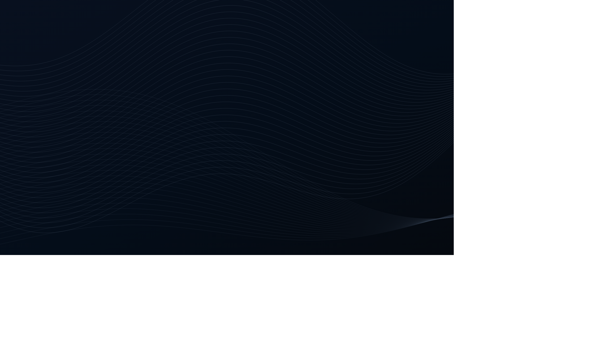
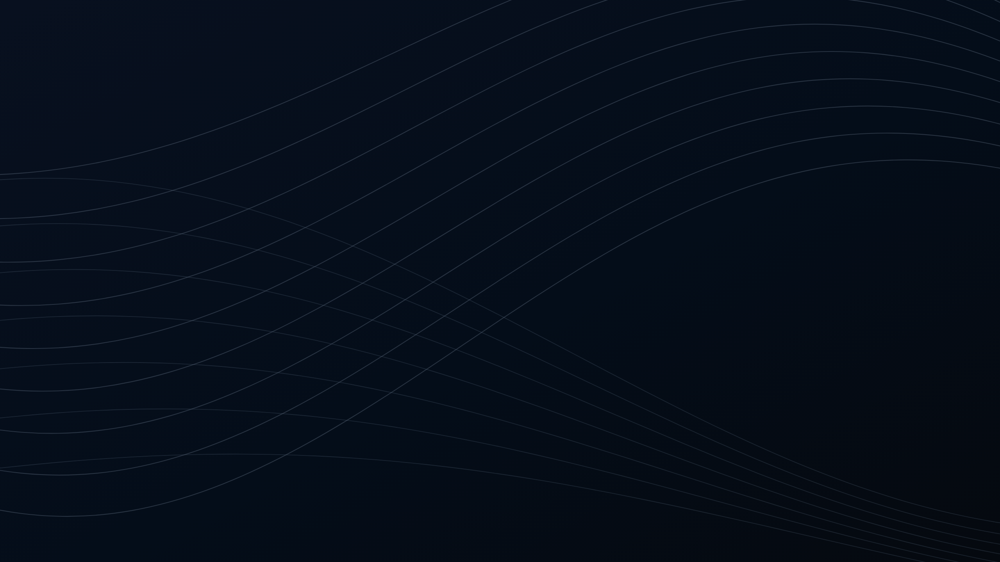
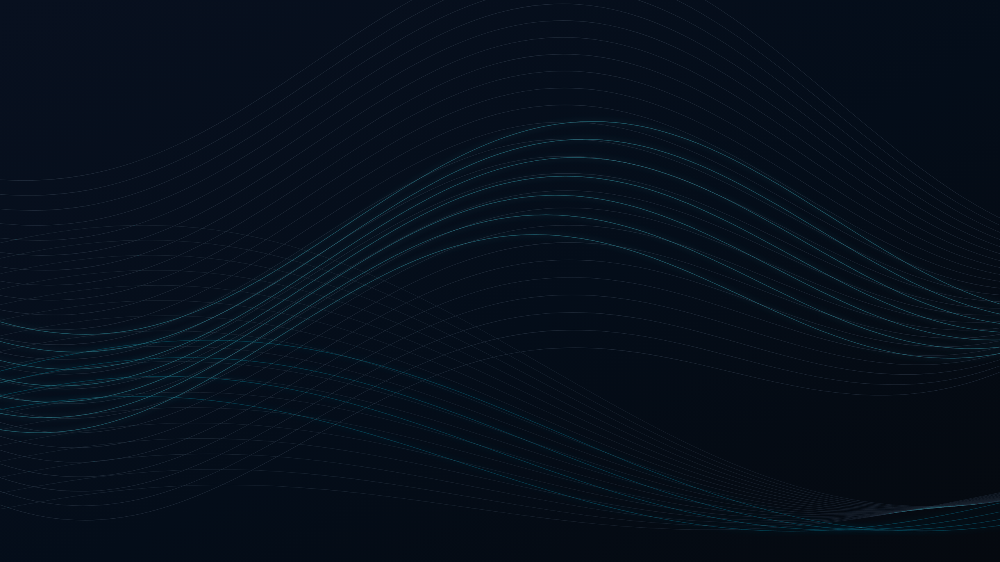
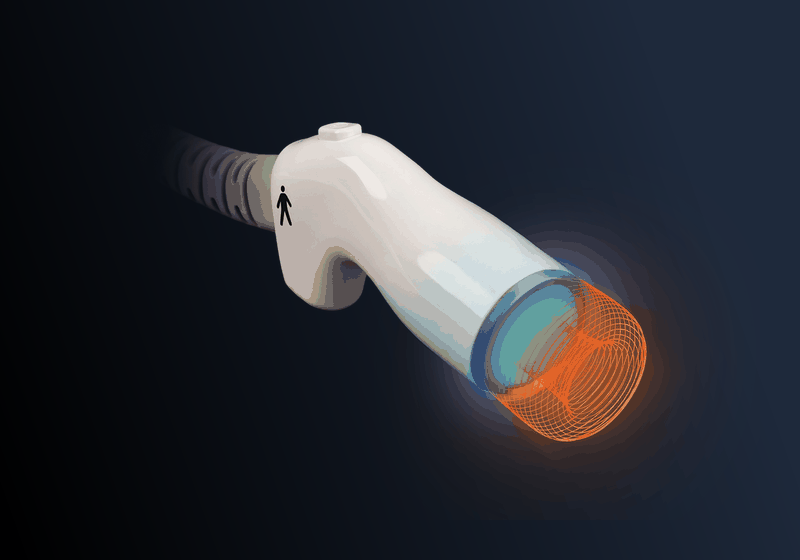
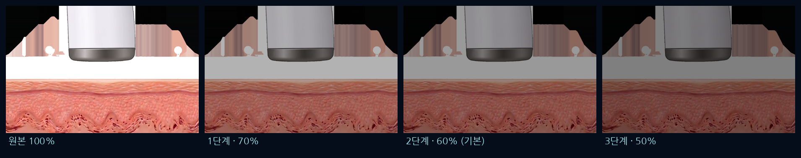
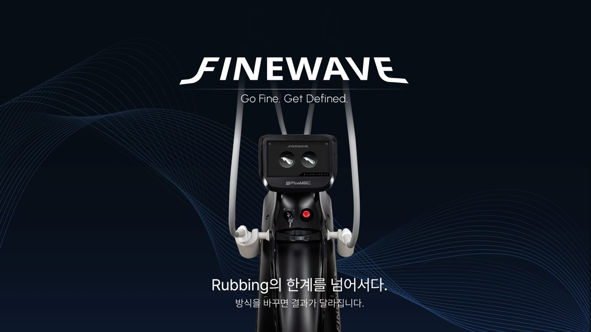
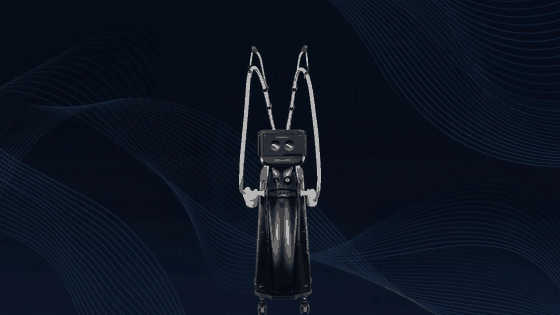

# 파인웨이브 홈페이지 리뉴얼 — 디자인 시안 컨펌 요청

> finewave.kr 개선 작업 시안입니다. 아래 **4개 항목**만 회신해 주시면 됩니다.
> (모든 움직임 효과는 실제 적용 시 지금 화면보다 더 부드럽게 재생됩니다 — 여기 GIF는 미리보기용 데모입니다)

| 컨펌 항목 | 선택지 |
|---|---|
| ① 웨이브 배경 | A / B / C 중 택1 |
| ② 빔 깜빡임 | 진행 OK / 수정 요청 |
| ③ NO CONTACT 어둡기 | 70% / 60% / 50% 중 택1 |
| ④ 메인 화면 배경 모션 | 진행 OK / 보류 |

---

## ① 2.45GHz 섹션 웨이브 배경 (3종 중 택1)

현재 배경의 라인 깨짐(계단 현상)을 해결하기 위해 고해상도로 새로 제작했습니다. 사이트의 다크 네이비 톤을 그대로 유지합니다.

### A안 — 파인라인 (현행과 가장 유사한 촘촘한 라인)


### B안 — 루즈 웨이브 (곡률이 크고 여백이 살아있는 라인)


### C안 — 시안 글로우 (브랜드 포인트 컬러의 은은한 발광 라인)


---

## ② FINECOOL™ 핸드피스 빔 깜빡임

기존 핸드피스 이미지를 보정해 빔 발광부가 **2.8초 주기로 은은하게 점등–소등**을 반복합니다.



- 실제 적용 시 지금보다 부드러운 페이드로 재생됩니다
- 시스템 설정에서 '움직임 줄이기'를 켠 사용자에게는 점등 상태의 정지 이미지로 표시됩니다

---

## ③ FRCCS 섹션 — NO CONTACT 카드 어둡기

CONTACT(시술 중) 카드와의 대비를 위해 NO CONTACT 카드를 어둡게 처리합니다. 3단계 중 선택해 주세요.



---

## ④ 메인 화면(히어로) 배경 모션

장비는 그대로 고정되고 **배경의 웨이브만 천천히 흐르는** 연출입니다. (참고: xerf.kr 메인)

**현재 (정지 이미지 1장)**



**개선안 (장비 고정 + 배경 드리프트) — 데모**



- 실제 적용은 20–30초 주기의 훨씬 느리고 미세한 움직임입니다 (데모는 빠르게 압축)
- 배경 이미지는 기존 메인 이미지에서 장비를 분리·보정해 제작한 것입니다
- 로고·문구 텍스트는 기존과 동일하게 배경 위에 다시 올라갑니다

---

## 회신 방법

아래 형식으로 회신 주시면 바로 반영하겠습니다.

```
① 웨이브: A / B / C
② 빔 깜빡임: OK / 수정(내용: )
③ NO CONTACT: 70 / 60 / 50
④ 배경 모션: OK / 보류
```

*문의: 노아마케팅랩 (noahmarketinglab@gmail.com)*
